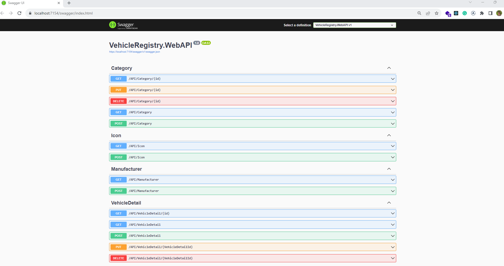
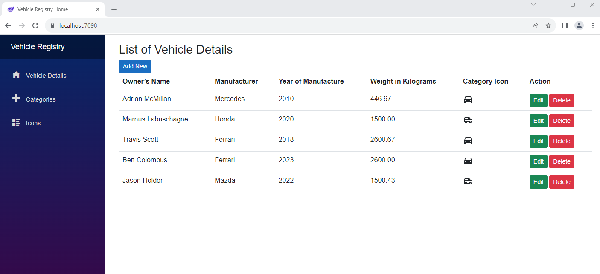
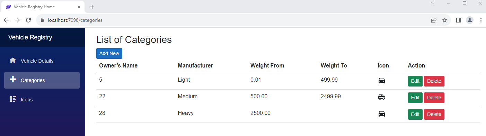
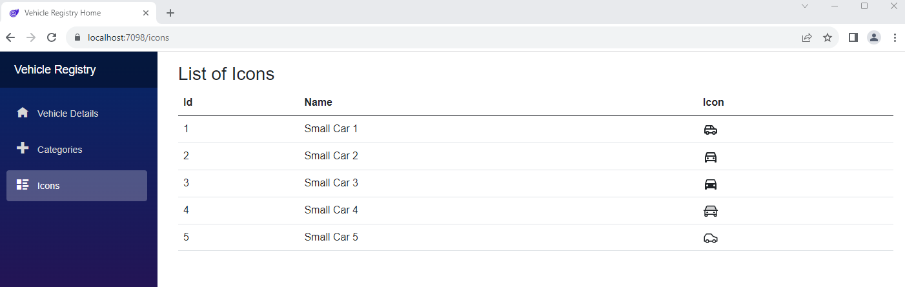

| Tech          | Version       |
| ------------- | ------------- |
| C#            |         10    |
| .NET          |           7   |
| Blazor        |      -        |

This is a Vehicle Registry Management systems implemented following best practises and SOLID principles. This is following clean architecture and CQRS pattern for alow to expand it large scale application.
docs folder contains screenshots diagrams and readme file

src has Infrastructure, Domain, Application, API and WebUI

Infrastructure folder - it has VehicleRegistry.DAL C# class library project(.NET 7.0) included the database file(VehicleRegistryDB.mdf) 
Domain folder - it has VehicleRegistry.Core C# class library project(.NET 7.0) included, all the enities for the database
Application folder - it has VehicleRegistry.Application C# class library project(.NET 7.0) included, CQRS implentation
API folder - its include VehicleRegistry.WebAPI  C# Web API project(.NET 7.0)
WebUI - its include VehicleRegistry.Blazor Web Assembly Blazor project(.NET 7.0)

test folder has VehicleRegistry.Application.UnitTest Xunit unit test project

# Vehicle Registry Web API and Blazor App

This project consists of a Web API and a Blazor web application for managing vehicle details, categories, and icons.

## Table of Contents

- [Project Structure](#project-structure)
- [Getting Started](#getting-started)
  - [Prerequisites](#prerequisites)
  - [Running the Application](#running-the-application)
- [API Endpoints](#api-endpoints)
- [Blazor Application](#blazor-application)
- [Unit Tests](#unit-tests)
- [License](#license)

## Project Structure

- **VehicleRegistry.WebAPI**: Contains the Web API for managing vehicle details, categories, and icons.
- **VehicleRegistry.Blazor**: Contains the Blazor web application for interacting with the API.
- **VehicleRegistry.Application**: Contains application-specific logic, including commands, queries, and DTOs.
- **VehicleRegistry.Core.Models**: Contains the core data models used in the application.
- **VehicleRegistry.Application.UnitTest**: Contains unit tests for the application.

## Getting Started

### Prerequisites

- [.NET SDK](https://dotnet.microsoft.com/download/dotnet) for building and running the application.
- [Visual Studio Code](https://code.visualstudio.com/) or [Visual Studio](https://visualstudio.microsoft.com/) for code editing (optional).

### Running the Application

1. Clone this repository to your local machine.

   ```shell
   git clone https://github.com/kelumkp/vehicle-registry.git

## API Endpoints



### Vehicle Details

###### GET /API/VehicleDetail: Get a list of all vehicle details.
###### GET /API/VehicleDetail/{id}: Get details of a specific vehicle by ID.
###### POST /API/VehicleDetail: Create a new vehicle detail.
###### PUT /API/VehicleDetail/{id}: Update an existing vehicle detail.
###### DELETE /API/VehicleDetail/{id}: Delete a vehicle detail by ID.

### Categories

###### GET /API/Category: Get a list of all categories.
###### GET /API/Category/{id}: Get details of a specific category by ID.
###### POST /API/Category: Create a new category.
###### PUT /API/Category/{id}: Update an existing category.
###### DELETE /API/Category/{id}: Delete a category by ID.

### Icons

###### GET /API/Icon: Get a list of all icons.
###### GET /API/Icon/{id}: Get details of a specific icon by ID.
###### POST /API/Icon: Create a new icon.
###### PUT /API/Icon/{id}: Update an existing icon.
###### DELETE /API/Icon/{id}: Delete an icon by ID.






